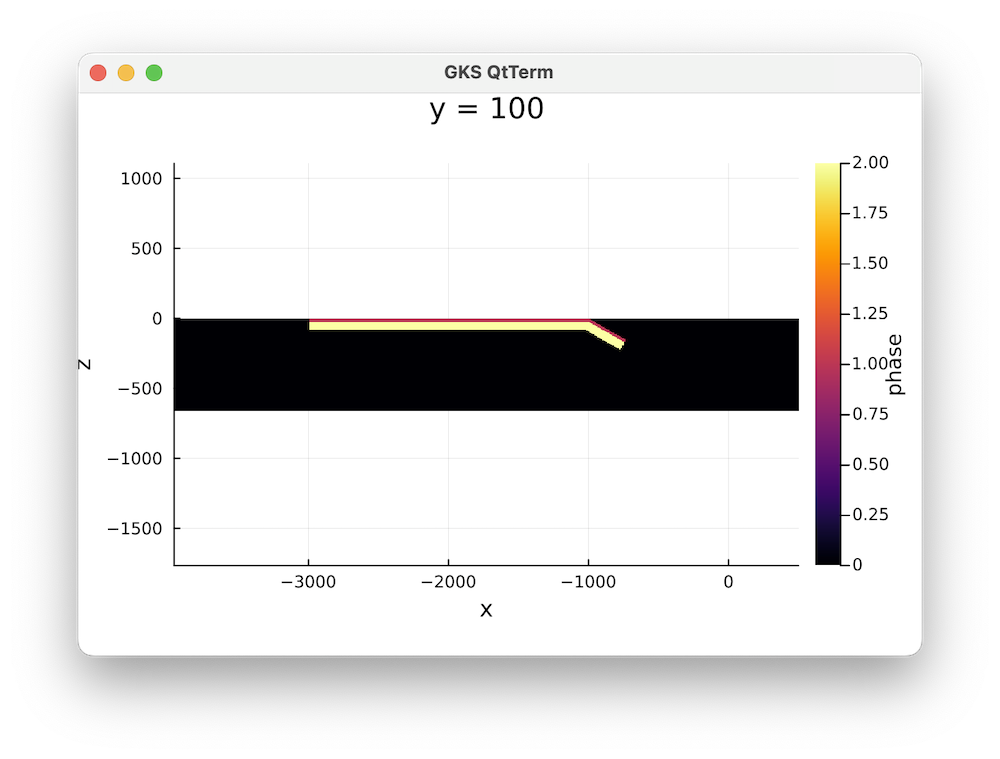

```@meta
EditURL = "../../scripts/Subduction3D.jl"
```

# 3D Subduction example

This is a 3D subduction example for `LaMEM.jl` that illustrates how to use the julia interface.
This is very similar to the setup described by Schellart and coworkers in a [2007 nature paper](https://www.nature.com/articles/nature05615) in which they demonstrate that toroidal flow changes the slab curvature during subduction as a function of slab width.

## 1. Generate main model setup
We first load the packages:

````@example Subduction3D
using LaMEM, GeophysicalModelGenerator
````

Next, we generate the main model setup, specifying the resolution and grid dimensions.
Note that a range of default values will be set, depending on the parameters you specify.

````@example Subduction3D
model = Model(
                Grid(nel=(128,32,64), x=[-3960, 500], y=[0,2640], z=[-660 ,0]), # Define the grid

                BoundaryConditions(noslip = [0, 0, 0, 0, 1, 0]), # No slip lower boundary; the rest is free slip

                Solver(SolverType="multigrid", MGLevels=4, MGCoarseSolver="mumps",  # We use a multigrid solver with 4 levels
                        PETSc_options=[ "-snes_type ksponly",
                                        "-js_ksp_rtol 1e-3",
                                        "-js_ksp_atol 1e-4",
                                        "-js_ksp_monitor"]),

                Output(out_file_name="Subduction_3D", out_dir="Subduction_3D"),         # Output filename

                Time(nstep_max=200, nstep_out=5, time_end=100, dt_min=1e-5),            # Timestepping etc

                Scaling(GEO_units(length=1km, stress=1e9Pa) )       # Scaling
            )
````

## 2. Define geometry
Next, we specify the geometry of the model, using the `AddBox!` function from `GeophysicalModelGenerator`.
We start with the horizontal part of the slab. The function `AddBox!` allows you to specify a layered lithosphere; here we have a crust and mantle. It also allows specifying a thermal structure.
Since the current setup is only mechanical, we don't specify that here.

````@example Subduction3D
AddBox!(model, xlim=(-3000,-1000), ylim=(0,1000), zlim=(-80,0), phase=LithosphericPhases(Layers=[20,60], Phases=[1,2]))
````

The inclined part of the slab is generate by giving it a dip:

````@example Subduction3D
AddBox!(model, xlim=(-1000,-810), ylim=(0,1000), zlim=(-80,0), phase=LithosphericPhases(Layers=[20,60], Phases=[1,2]), DipAngle=16)
````

There is a simple way to have a quick look at this setup by using the `Plots.jl` package:

```julia
using Plots
plot_cross_section(model, y=100, field=:phase)
```

Which will give the following plot:


## 3. Add material properties:
We can specify material properties by using the `Phase` function

````@example Subduction3D
mantle = Phase(Name="mantle",ID=0,eta=1e21,rho=3200)
crust  = Phase(Name="crust", ID=1,eta=1e21,rho=3280)
slab   = Phase(Name="slab",  ID=2,eta=2e23,rho=3280)
````

and we can add them to the model with:

````@example Subduction3D
add_phase!(model, mantle, slab, crust)
````

You can check that this is set with:

````@example Subduction3D
model
````

```julia
LaMEM Model setup
|
|-- Scaling             :  GeoParams.Units.GeoUnits{GEO}
|-- Grid                :  nel=(128, 32, 64); xϵ(-3960.0, 500.0), yϵ(0.0, 2640.0), zϵ(-660.0, 0.0)
|-- Time                :  nstep_max=200; nstep_out=5; time_end=100.0; dt=0.05
|-- Boundary conditions :  noslip=[0, 0, 0, 0, 1, 0]
|-- Solution parameters :  eta_min=1.0e18; eta_max=1.0e25; eta_ref=1.0e20; act_temp_diff=0
|-- Solver options      :  multigrid solver; coarse grid solver=mumps; 4 levels
|-- Model setup options :  Type=files;
|-- Output options      :  filename=Subduction_3D; pvd=1; avd=0; surf=0
|-- Materials           :  3 phases;
```

## 4. Run the model
Add this stage, we are ready to run the simulation. On my machine it takes around 4 seconds per timestep on 8 cores:

```julia
run_lamem(model, 8)
```

The results looks like this with paraview:

Note that this is a significantly higher resolution than the original paper, which was run on an HPC system (admittedly, this was 20 years ago).

The file `Subduction_3D.jl` in `/scripts` reproduces this example

---

*This page was generated using [Literate.jl](https://github.com/fredrikekre/Literate.jl).*

