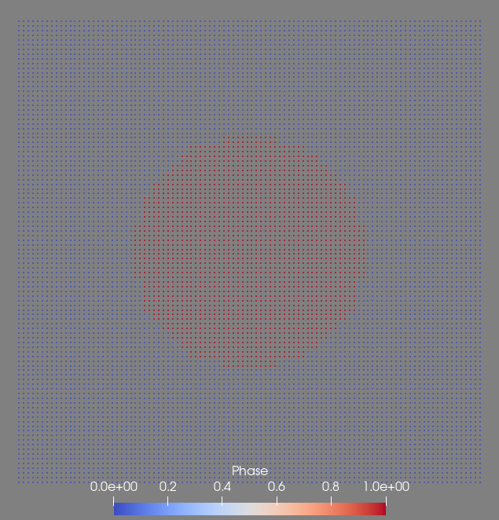
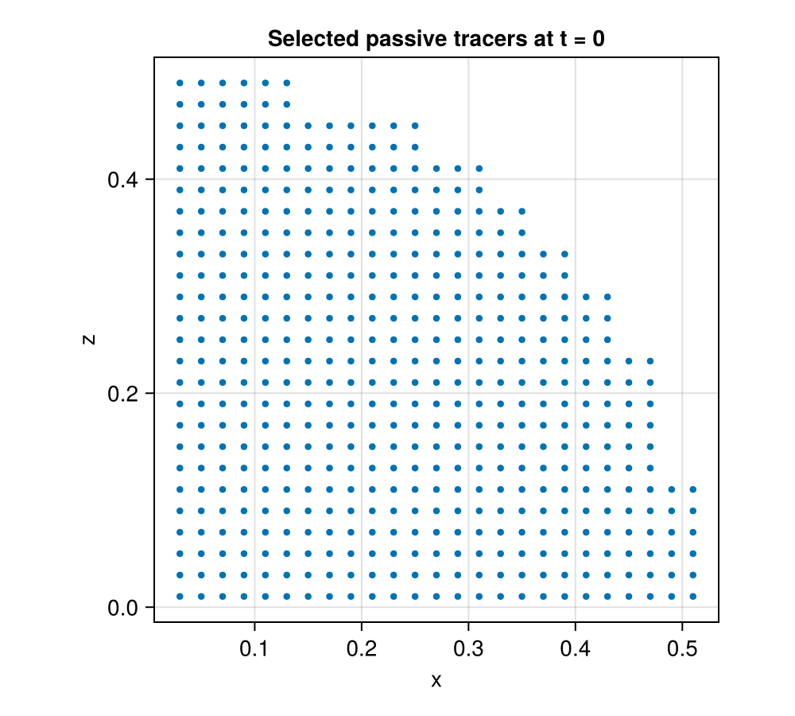
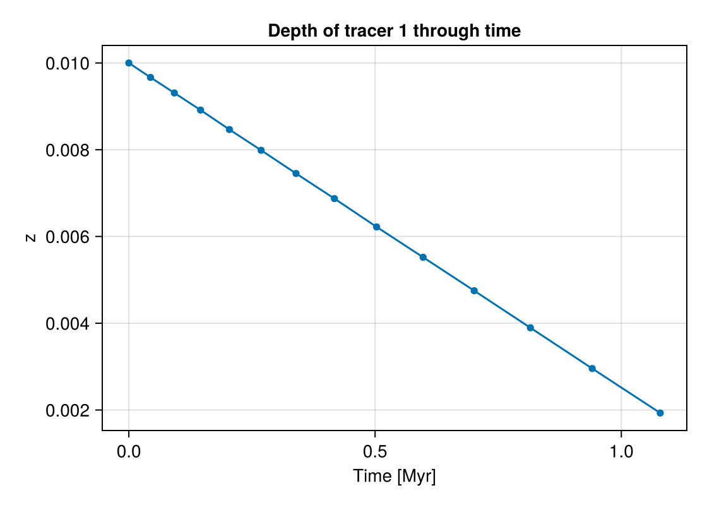

# Initiate passive tracers and read their information 
Passive tracers are useful to track the evolutions of the temperature, pressure and their spatial positions of moving materials during the simulation. Passive tracers can be initiated when you start a new model, and they are the Lagrangian points that move with the materials. The initiation and extraction of information from passive tracers can be easily done using the following methods.

### Initiate passive tracers in the model
Let's use a simple model of a "falling sphere" as the example. We initiate the passive tracers by turning on the flag: `Passive_Tracer=1` and assign a spatial range to populate tracers in the entire simulation box `PassiveTracer_Box=[-1,1,-1,1,-1,1])`. The default tracer density is 100 x 1 x 100 along x, y, z axes. 
```julia
using LaMEM, GeophysicalModelGenerator, CairoMakie

model  = Model(Grid(nel=(16,16,16), x=[-1,1], y=[-1,1], z=[-1,1]), PassiveTracers(Passive_Tracer=1, PassiveTracer_Box=[-1,1,-1,1,-1,1]))
matrix = Phase(ID=0,Name="matrix",eta=1e20,rho=3000)
sphere = Phase(ID=1,Name="sphere",eta=1e23,rho=3200)
add_phase!(model, sphere, matrix)
add_sphere!(model,cen=(0.0,0.0,0.0), radius=0.5)

run_lamem(model,1)
```
The model output files should include a file called `output_passive_tracers.pvd` which you can visualize using ParaView. The image below shows the initial state (t=0) of all tracers. Different colors represent  different phases of the tracers: Phase 0 is blue, Phase 1 is red.



### Read passive tracers information back to Julia
We can check the overall passive tracers information at timestep = 0 using:
```julia
data,time = read_LaMEM_timestep(model, 0, passive_tracers=true)
```
It returns:
```julia
(CartData 
    size    : (10000,)
    x       ϵ [ -0.99 : 0.99]
    y       ϵ [ 0.0 : 0.0]
    z       ϵ [ -0.99 : 0.99]
    fields  : (:Phase, :Temperature, :Pressure, :ID)
, [0.0])
```
The `data.x`, `data.y`, and `data.z` are structures that contain spatial information of tracers while parameters such like `data.fields.Phase` contain the phase, temperature, pressure and index (ID) of tracers.

Sometimes we want to select tracers in a smaller region for further investigation. For example, to track the P-T-t evolution of a subducting slab, we can specify a region of interest (e.g., the upper crust portion of the slab) therefore select tracers within that region only.

In the "falling sphere" example, let's find all the "sphere phase" tracers in the 1st quadrant (x>0, and z>0) of the sphere.

```julia
ID = findall(data.x.val .> 0 .&& data.z.val .> 0 .&& data.fields.Phase .== 1)
```
The `ID` parameter records the indices of these tracers. Note we need to do `data.x.val` to get the numerical value of the x-coordinate because `data.x` is a `GeoUnit` structure also containing `unit`, and `isdimensional` information. The dot in front of `>` and `&&`  implies that it is applied to every point the array data.

Once we select the tracers of interest (we now know the ID of these tracers), we can read their information.
```julia
passive_tracers = passivetracer_time(ID,model)
```
Let's take a look at the `passive_tracers`, and see what information it contains:
```julia
# Retrieve the keys from the passive_tracers
keys_list = keys(passive_tracers)

# Iterate over each key and print the size of the associated data
for key in keys_list
    data_size = size(passive_tracers[key])
    println("Key: $key, Size: $data_size")
end
```
It returns:
```julia
Key: x, Size: (489, 4)
Key: y, Size: (489, 4)
Key: z, Size: (489, 4)
Key: Phase, Size: (489, 4)
Key: Temperature, Size: (489, 4)
Key: Pressure, Size: (489, 4)
Key: Time_Myrs, Size: (4,)
```
The `passive_tracers` contains spatial coordinates and P, T, Phase properties and also the associated temporal information for all 4 time steps in matrixes. Now let's plot the position of selected tracer at t=0.

```julia
fig = Figure(size=(500,450))
ax  = Axis(fig[1,1], xlabel="x", ylabel="z",
           title="Selected passive tracers at t = 0", aspect=DataAspect())
scatter!(ax, passive_tracers.x[:,1], passive_tracers.z[:,1], markersize=6)
fig
```


which is the quarter of the sphere that the selection asked for.

The same data gives the evolution of a single tracer through time. Here we follow the first
of the 489 tracers as the sphere sinks:
```julia
fig = Figure(size=(560,400))
ax  = Axis(fig[1,1], xlabel="Time [Myr]", ylabel="z",
           title="Depth of tracer 1 through time")
lines!(ax, passive_tracers.Time_Myrs, passive_tracers.z[1,:])
scatter!(ax, passive_tracers.Time_Myrs, passive_tracers.z[1,:], markersize=8)
fig
```


A P-T path is plotted the same way, from `passive_tracers.Temperature` and
`passive_tracers.Pressure`:
```julia
lines(passive_tracers.Temperature[1,:], passive_tracers.Pressure[1,:])
```
Note that the "falling sphere" example is isothermal and only runs for a few timesteps, so
its P-T path carries little information; a P-T path is worth plotting for a thermomechanical
model such as [2D Thermomechanical subduction model](@ref).

It is also doable to plot the the average P, T properties of a small group of tracers of our selection.
