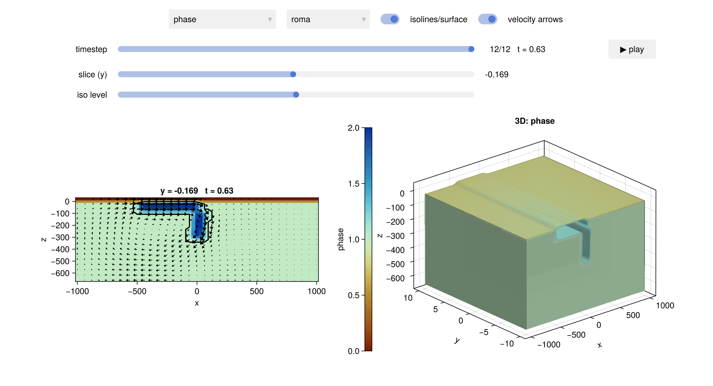
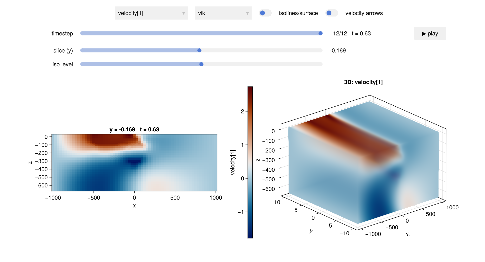

# Interactive viewer

`view_model` opens an interactive window on a LaMEM simulation, as an alternative to loading
the output into Paraview. It is part of the Makie extension, so it appears once you load a
Makie backend:

```julia
julia> using LaMEM, GLMakie
julia> view_model(model)
```



Use **GLMakie** for this: the 3D view needs a real 3D rasterizer, which CairoMakie does not
have. Under CairoMakie the cross-section still works and the 3D panel stays empty, which is
enough to write a movie on a machine without a display (see below).

## What the window shows

On the left a cross-section through the model, on the right a 3D view of the same field, with
controls above them for:

- the **field** to display. Every field in the output is listed, and a vector field is
  expanded per component, so the velocity appears as `velocity[1]`, `velocity[2]` and
  `velocity[3]`.
- the **timestep**, as a slider. The `▶ play` button animates the simulation.
- the **slice position**, which moves the cross-section through the model. By default the
  section cuts the thinnest direction, which for a quasi-2D LaMEM setup is the plane worth
  looking at; give `x`, `y` or `z` to pin another one.
- **isolines/surface**, which draws a contour of the displayed field on the cross-section and
  an isosurface in the 3D view, at the level set by the `iso level` slider. This is on by
  default, since volume rendering shows little of a phase field.
- **velocity arrows** on the cross-section, scaled to the largest velocity in the section.
- the **colormap**.

The viewer also opens on a model that has not been run, in which case it shows the initial
setup — useful to check a setup before starting a simulation:

```julia
julia> model = Model(Grid(nel=(64,2,32), x=[-1000,1000], y=[-10,10], z=[-660,20]))
julia> add_box!(model; xlim=(-500,0), zlim=(-80,0), phase=ConstantPhase(2))
julia> view_model(model)          # no need to run LaMEM first
```

## Choosing what to show

The keyword arguments set what the window starts with; everything remains adjustable in the
window itself.

```julia
julia> view_model(model, field=:velocity, dim=1, colormap=:vik, isosurface=false)
```



- `field`, `dim`: the field and, for a vector field, the component
- `x`, `y`, `z`: where to cut the cross-section
- `colormap`: any Makie colormap
- `isosurface`, `arrows`: whether those start switched on
- `size`: the size of the window

## Saving a movie

`save_movie` writes an animation of the simulation to disk, stepping through its timesteps.
The format follows the extension:

```julia
julia> save_movie("subduction.mp4", model, field=:phase)
julia> save_movie("subduction.gif", model, field=:temperature, colormap=:vik)
```

It takes the same keyword arguments as `view_model`, plus `framerate`. Since this needs no
interaction, it also works headlessly with CairoMakie — on an HPC node, for instance — as
long as you do not need the 3D panel:

```julia
julia> using LaMEM, CairoMakie
julia> save_movie("subduction.mp4", model, field=:phase)
```
